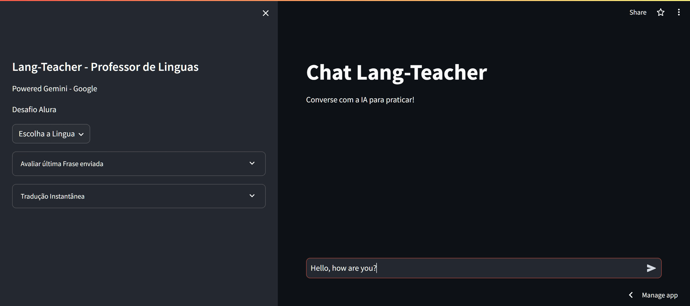

# AI-language-teacher

Este projeto é um site interativo que atua como um professor de linguas virtual onde você escolhe qual lingua praticar. Ele permite que os usuários conversem via chat, avaliem frases escritas e traduzam qualquer frase, tudo na mesma interface.

### 🚀 URL da aplicação Funcionando

Acesse através do link [https://ai-lang-teacher.streamlit.app](https://ai-lang-teacher.streamlit.app)

## Funcionalidades

1. **Chat em Inglês**: Os usuários podem praticar conversando com o agente de IA.
2. **Avaliação de Frases**: O site pode avaliar a gramática e a estrutura das frases escritas pelos usuários.
3. **Tradução de Frases**: Qualquer frase pode ser traduzida para a lingua que está praticando.

## Desenvolvimento

O projeto foi desenvolvido usando Streamlit e Python. A inteligência artificial usada é o Google Gemini.